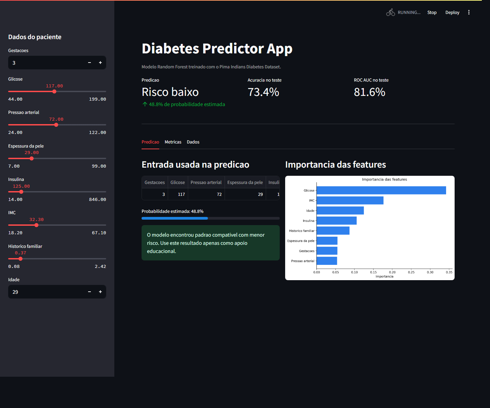

# Diabetes Predictor App

Aplicativo de Machine Learning feito com Streamlit e Scikit-Learn para estimar risco de diabetes a partir de dados clinicos do Pima Indians Diabetes Dataset.



## Visao geral

Este projeto transforma um modelo de classificacao em uma aplicacao interativa: o usuario informa variaveis clinicas, o app retorna uma probabilidade estimada e apresenta metricas do modelo, matriz de confusao, comparacao entre algoritmos e importancia das features.

> Uso exclusivamente educacional. A predicao nao substitui avaliacao medica, exames laboratoriais ou orientacao profissional.

## App ao vivo

O projeto esta pronto para deploy no Streamlit Cloud. Depois de publicar, adicione o link aqui e no campo "Website" do repositorio.

Sugestao para curriculo:

`Diabetes Predictor App | Python, Scikit-Learn, Streamlit | app interativo de ML com metricas, matriz de confusao e explicabilidade por importancia de features`

## Objetivo

O projeto demonstra um fluxo completo e simples de classificacao:

- carregamento e tratamento do dataset;
- treino de um modelo Random Forest;
- salvamento do modelo treinado;
- interface interativa para predicao ao vivo;
- visualizacao de metricas e importancia das features.

## Resultado do modelo

O modelo foi avaliado com uma divisao treino/teste estratificada, usando 20% dos dados para teste.

| Metrica | Valor |
| --- | ---: |
| Acuracia | 73.4% |
| Precisao | 60.0% |
| Recall | 72.2% |
| F1-score | 65.5% |
| ROC AUC | 81.6% |

## Comparacao de modelos

Dois modelos foram treinados com a mesma divisao de treino/teste. O Random Forest foi mantido como modelo principal por apresentar o melhor ROC AUC.

| Modelo | Acuracia | Precisao | Recall | F1-score | ROC AUC |
| --- | ---: | ---: | ---: | ---: | ---: |
| Random Forest | 73.4% | 60.0% | 72.2% | 65.5% | 81.6% |
| Logistic Regression | 73.4% | 60.3% | 70.4% | 65.0% | 81.3% |

## Funcionalidades do app

- Formulario lateral para informar dados do paciente.
- Predicao ao vivo com probabilidade estimada.
- Abas para predicao, metricas e exploracao dos dados.
- Matriz de confusao.
- Comparacao entre Logistic Regression e Random Forest.
- Grafico de importancia das features.
- Grafico de distribuicao por variavel.
- Modelo salvo em `models/diabetes_random_forest.joblib`.

## O que este projeto demonstra

- Criacao de pipeline de Machine Learning com tratamento de valores ausentes.
- Separacao entre treino do modelo (`train_model.py`), logica de ML (`diabetes_model.py`) e interface (`app.py`).
- Uso de metricas adequadas para classificacao binaria: acuracia, precisao, recall, F1-score e ROC AUC.
- Comparacao entre modelos simples antes da escolha do modelo final.
- Comunicacao responsavel de resultados em um problema sensivel de saude.

## Tecnologias

- Python
- Streamlit
- Pandas
- Scikit-Learn
- Matplotlib
- Joblib

## Como rodar localmente

Instale as dependencias:

```bash
pip install -r requirements.txt
```

Treine novamente o modelo, se quiser atualizar o arquivo salvo:

```bash
python train_model.py
```

Execute o app:

```bash
streamlit run app.py
```

Se estiver no Windows e o comando `python` nao funcionar, use:

```bash
py train_model.py
py -m streamlit run app.py
```

## Estrutura do projeto

```text
.
+-- app.py
+-- diabetes_model.py
+-- train_model.py
+-- requirements.txt
+-- assets/
|   +-- app-screenshot.png
+-- data/
|   +-- diabetes.csv
+-- models/
    +-- diabetes_random_forest.joblib
+-- reports/
    +-- model_comparison.csv
```

## Dataset

O projeto usa o Pima Indians Diabetes Dataset, salvo em `data/diabetes.csv`.

Features usadas pelo modelo:

- Pregnancies
- Glucose
- BloodPressure
- SkinThickness
- Insulin
- BMI
- DiabetesPedigreeFunction
- Age

Variavel alvo:

- Outcome

## Deploy gratuito no Streamlit Cloud

1. Acesse [share.streamlit.io](https://share.streamlit.io/).
2. Conecte sua conta GitHub.
3. Escolha o repositorio `nicolasagra-dev/diabetes-predictor-app`.
4. Configure:
   - Branch: `main`
   - Main file path: `app.py`
5. Clique em Deploy.
6. Copie o link gerado e adicione na secao "App ao vivo" deste README.
7. Adicione o mesmo link no campo "Website" do repositorio e no curriculo.

## Limitacoes

Este projeto tem finalidade educacional. O dataset e pequeno, vem de um recorte especifico e pode conter vieses. As variaveis de entrada nao representam uma avaliacao clinica completa, e o resultado do modelo nao deve ser usado para diagnostico ou tomada de decisao medica.
